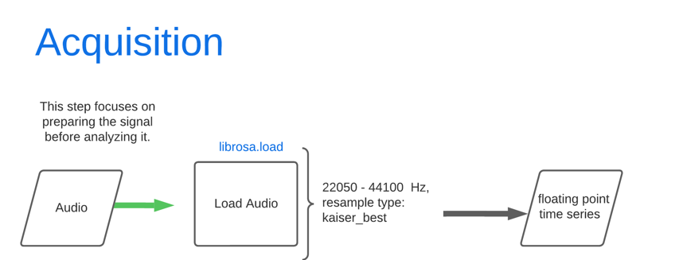
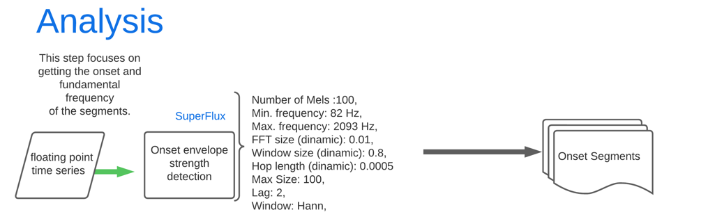
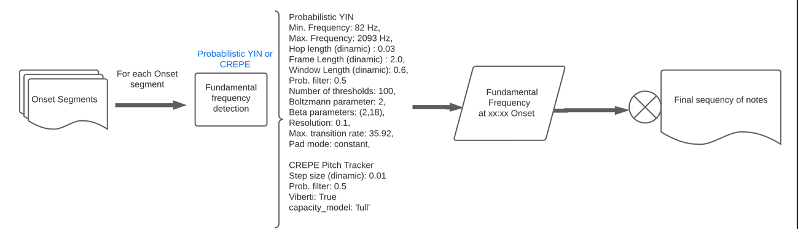
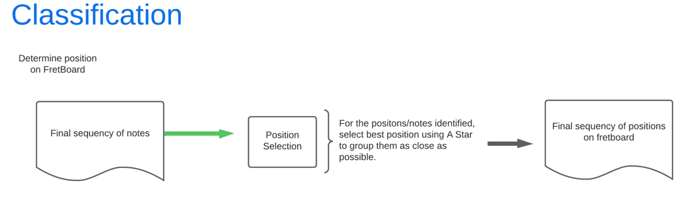
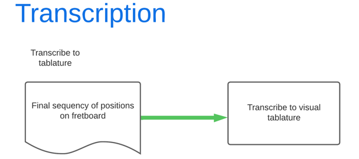

# Automatic Transcription of monophonic guitar audios to tablature

The objective of this work is to use methods
of digital signal processing for feature extraction and
recognition of musical signals from monophonic guitar
audio for automatic tablature transcription. The Super
Flux, Probabilistic Yin, CREPE Pitch Tracker and A-star
methods are employed.
This project was built for a undergraduated final thesis.
The original paper is avaiable at: https://repositorio.ufu.br/handle/123456789/38851 

Keywords – audio, digital, engineering, guitar,
processing, signal, songs, transcription

# Topics

- [How it works?](#how-it-works)
- [Stages](#stages)
- [Results](#results)

# How it works?

``python app.py``

The standard values presented are percentages relative to the number o samples (read the article for more info).

# Stages

## Acquistion

The first step focuses on loading this audio file into quantized amplitude values over time as a sequence of 32-bit floating-point numbers converted by the `load` method of the Librosa library. This method takes, along with the audio file, its sampling frequency and other optional parameters such as offset and duration, in case you want to extract only a portion of the audio for analysis.

## Analysis

After loading the file, the respective data is passed to the Onset stage, which will return start and end time values for sound events identified in the audio. In the scope of this work, these events are the musical notes played by the instrument in a monophonic manner.

With these values in hand, the audio data is segmented, corresponding to the start and end of these notes. These segments are then passed to the next stage of fundamental frequency identification. In this identification stage, the algorithm utilizes the time-domain data and returns the identified note, indicating its octave in textual form (A3, B4, C5, etc.). For each note segment, a note value is found and added to a list, which is returned in the end, containing all the notes, in sequence, found in the input audio file.

## Classification

With the final list containing the identified notes in the audio and a mapping of existing notes on the instrument's fretboard, an optimization algorithm, A Star, is used. It seeks to logically find the best positions for playing the identified notes, with the deciding factor being the proximity between them.

## Transcription

The final stage returns, in ASCII text form, the tablature, containing finger positions for playing the identified notes on the instrument.

# Results

With the parameter that deliver the best performance (choices made in the tests from the original paper written by this author avaiable at https://repositorio.ufu.br/handle/123456789/38851), testing was carried out on various audio sets from datasets 2 and 3 of the IDMT-SMT-Guitar database, which contain 6 monophonic excerpts played on three different guitar brands in 2 versions (dataset 2) and 2 monophonic songs (dataset 3) played on the Ibanez RG 2820 guitar. The final results were as follows:

- Accuracy: 0.9662007583060216
- Precision: 0.9909774436090226
- Recall: 0.9662007583060216
- F-Measure: 0.9773000388079276
- Levenshtein Distance: 0.5

For a second test, the algorithm is put into practice in real home scenarios. It makes use of 10 recordings made by the author with their own instrument, including excerpts of songs recorded on a cellphone using a lapel microphone. The following results were obtained:

- Accuracy: 0.878409090909091
- Precision: 0.8529817404817404
- Recall: 0.878409090909091
- F-Measure: 0.865111494451153
- Levenshtein Distance: 1.5

The results demonstrate excellent performance for home recordings and practical scenarios, paving the way for future improvements.